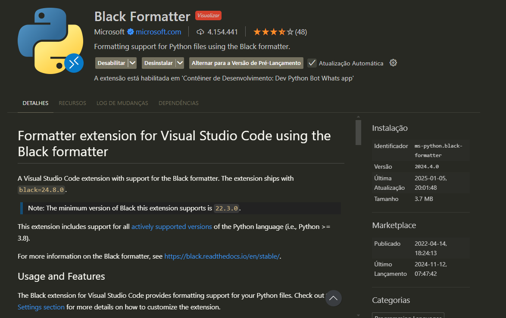

### Acessando o ambiente de desenvolvimento com Devcontainers
- [Devcontainers](https://marketplace.visualstudio.com/items?itemName=ms-vscode-remote.remote-containers)

2. Abra o Visual Studio Code e acesse a pasta do projeto.
3. Quando abrir o projeto no Visual Studio Code, uma notificação será exibida perguntando se você deseja reabrir o projeto em um Devcontainer. Clique em `Reopen in Container`.

- Caso a notificação não seja exibida, pressione `ctrl+shift+p`  e selecione a opção `Reopen in Container`.

4. Aguarde o ambiente de desenvolvimento ser configurado. Isso pode levar alguns minutos.
5. Quando o ambiente de desenvolvimento estiver pronto, você verá uma notificação informando que o Devcontainer foi configurado com sucesso.
6. Apos a configuração do ambiente de desenvolvimento, o portry ira instalar as dependencias do projeto.

### Para adiconar uma extensão no devcontainer!
 

e pegue o indetificador da extensao que deseja adicionar e coloque no arquivo `devcontairns.json` em *extensions* o indentificador

